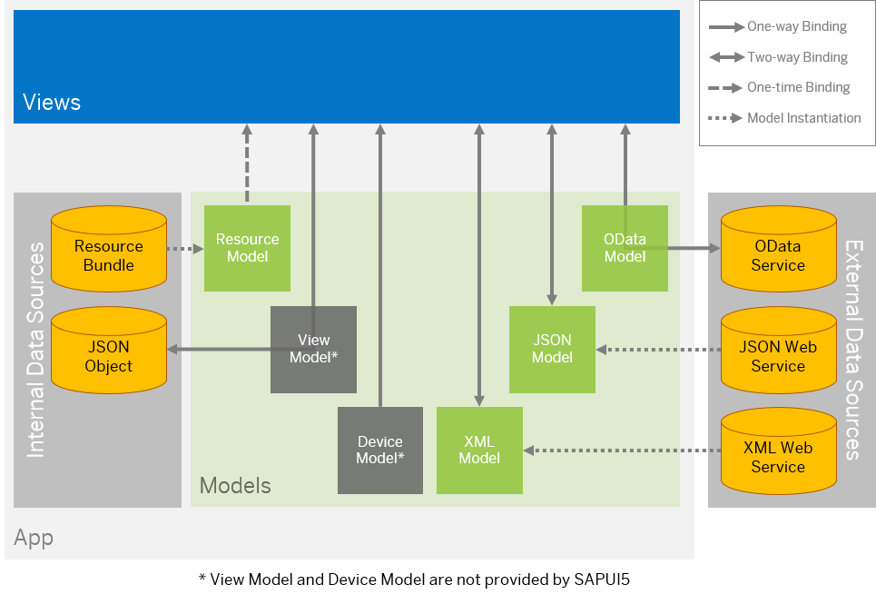
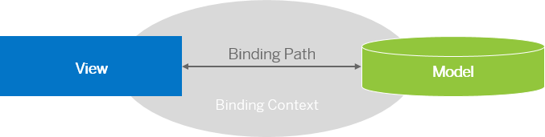

# Data Binding

Sử dụng data binding UI liên kết các elements UI cho phép data chỉnh sửa dữ liệu trên UI



SAPUI5 follows "MVC" => chúng tách biệt giữa `model`, `UI(view)` và `controller`. Data binding xác định cách model và view giao tiếp.

`resource model` : được sử dụng kết nối với `resource bundle` có thể được dịch bằng nhiều ngôn ngữ.

`device model`: chứa các setting `device-specific`, có thể truy xuất từ sap/ui/Device

`View models` : có thể JSON models với một JSONObject. JSON data cũng có thể được chỉnh sửa trong app nhưng chúng k được lưu trữ - ngay khi bạn làm mới trình duyệt hoặc khởi động lại ứng dụng, các thay đổi sẽ được đặt lại.

Trong view, bind data bằng binding path liên kết cho control.Bạn có thể data types và formatters trên UI

## Binding Modes: One-way Binding, Two-way Binding, and One-time Binding

`One-way binding` : có 1 ràng buộc từ nodel đến view. Bất cứ khi nào value nào trong model update tất các các binding và view.

`Two-way-binding`: là sự ràng buộc model đến view và từ view đến model bất kì.Bất kì thay đổi nào trong model hoặc các event trigger update sẽ động kích hoạt của tất cả liên kết tương ứng cũng như view và model

## Binding Types

### Property binding :

Property binding trên control, bạn có các option sau:

- Là một phần của khai báo của control trong chế độ xem XML
- Sử dụng JS Object trong constructor của control sử dụng method `bindProperty` control

Khi bạn xác định property binding, thuộc tính sẽ được update tự động mỗi giá trị thuộc của model thay đổi ngược lại

```js
{
	"company" : {
		"name"  : "Acme Inc.",
		"street": "23 Franklin St.",
		"city"  : "Claremont",
		"state" : "New Hampshire",
		"zip"   : "03301",
		"revenue": "1833990"
	}
}
```

Để xác định liên kết property binđing trong khai báo control trong dạng XML view, chỉ cần bao gồm đường liên kết trong dấu ngoặc nhọn

```xml
<mvc:View
  controllerName="sap.ui.sample.App"
  xmlns="sap.m"
  xmlns:mvc="sap.ui.core.mvc"
>
  <Input value="{/company/name}" />
</mvc:View>
```

Trong js, bạn có thể bao gồm đường dẫn trong dấu ngoặc nhọn trong object cài đặt

```js
// "Input" required from module "sap/m/Input"
var oInput = new sap.m.Input({
  value: "{/company/name}",
});
```

XML View, hãy bật cú pháp liên kết

```js
<script
  id="sap-ui-bootstrap"
  src="https://sdk.openui5.org/resources/sap-ui-core.js"
  data-sap-ui-theme="sap_belize"
  data-sap-ui-bindingSyntax="complex" // vàng
  data-sap-ui-async="true"
  data-sap-ui-onInit="module:sap/ui/sample/main"
  data-sap-ui-resourceRoots='{"sap.ui.sample": "./"}'
></script>
```

Bạn có thể set bindingMode hoặc các thuôc tính bổ khác ntn

```js
<mvc:View
  controllerName="sap.ui.sample.App"
  xmlns="sap.m"
  xmlns:mvc="sap.ui.core.mvc"
>
  <Input
    value="{
			path:'/company/name', 
			mode: 'sap.ui.model.BindingMode.OneWay' 
		}"
  />
</mvc:View>
```

Trong Js `View` hoặc `controller`, bạn sử dụng các object JS thay vì, bạn sử dụng một object jS thay vì `string literal`. Điều này phải chứua thuộc tính đường dẫn liên kết và có thể các thuộc tính bổ sung

```js
// "Input" required from module "sap/m/Input"
// "BindingMode" required from module "sap/ui/model/BindingMode"

var oInput = new Input({
  value: {
    path: "/company/name",
    mode: BindingMode.OneWay,
  },
});
```

Tùy thuộc vào trường hợp sử dụng, việc xác định liên kết sau này có thể hữu ích bằng cách sử dụng method `bindProperty`:

```js
oInput.bindProperty("value", "/company/name");
```

Tùy chọn này cũng cho phép bạn sử dụng cùng một nghĩa đen đối tượng mà bạn đã sử dụng trong hàm tạo để xác định liên kết:

```js
// "TypeInteger" required from module "sap/ui/model/type/Integer"

oInput.bindProperty("value", {
  path: "/company/name",
  type: new TypeInteger(),
});
```

Để remove thuộc tính binding ta sử dụng unbindPriperty method

```js
oTextField.unbindProperty("value");
```

### Formatting Property Values

Các value trong dữ liệu thường

- Formatter functions for one-way conversion

- Data types in two-way binding

Các data types có thể được sử dụng để phân tích cú pháp đầu vào của người dùng ngoài các giá trị định dạng.

### Using a Formatter Function

```js
sap.ui.define([
	"sap/ui/core/mvc/Controller",
	"sap/ui/model/json/JSONModel"
], function (Controller, JSONModel) {
	"use strict";
	return Controller.extend("sap.ui.sample.App", {
		……………
		roundToMillion: function(fValue) {
			if (fValue) {
				return "> " + Math.floor(fValue/1000000) + "M";
			}
			return "0";
		}
	});
});
```

### List Binding

Giả sử muốn hiển thị dữ liệu JSONModel sau đây

```js
{
  companies: [
    {
      name: "Acme Inc.",
      city: "Belmont",
      state: "NH",
      county: "Belknap",
      revenue: "123214125.34",
    },
    {
      name: "Beam Hdg.",
      city: "Hancock",
      state: "NH",
      county: "Belknap",
      revenue: "3235235235.23",
    },
    {
      name: "Carot Ltd.",
      city: "Cheshire",
      state: "NH",
      county: "Sullivan",
      revenue: "Not Disclosed",
    },
  ];
}
```

- Khai báo List Binding in XML Views

```js
<mvc:View
	controllerName="sap.ui.sample.App"
	xmlns="sap.m"
	xmlns:mvc="sap.ui.core.mvc">
	<List id=”companyList” items="{path: '/companies', templateShareable:false}">
		<items>
			<StandardListItem
				title="{name}"
				description="{city}"
			/>
		</items>
	</List>
</mvc:View>
```

List có cả items attribute và nested items element

- Thuộc tính `items ={ path:'/companies', templateShareable:false } liên kết các phần tử con của mảng `companies`trong jsonmodel của chúng tôi với danh sách. Bản thân điều này không đủ để hiển thị các`companies`, thay vào đó, nó đặt đường dẫn gốc để liên kết tất cả các mục trong danh sách được chứa và các mục con của chúng. Ngoài ra bạn cần khai báo một nested element..

- nested items element trong trường hợp của chúng tôi chứa `StandardListItem`. Điều này phục vụ như một mẫu để tạo các hàng danh sách riêng lẻ.

Thay vì sử dụng `StandardListItem` làm row template,sử dụng bất kì sap.m.listitem,

- ActionListItem

- DisplayListItem

- CustomListItem

- ObjectListItem

#### List Binding in the JavaScript Code

Xác định list binding trực tiếp trong JS ,object setting của construcotr hoặc thông qua method `bindAggegation`. Việc

Để bind a list, bạn tạo template hoặc cung cấp 1 factory function, sau đó sẽ được chuyển list binding. Trong object setting nó như sau:

```js
var oItemTemplate = new sap.ui.core.ListItem({text:"{name}"});
oComboBox = new sap.m.ComboBox({
	items: {
		path: "/companies",      //no curly brackets here!
		template: oItemTemplate
		templateShareable: false
	}
});
```

template không nhất thiết phải là một control duy nhất trong ví dụ trên mà còn có thể là 1 tree control.Đối với mỗi mục danh sách, một bản sao sâu của mẫu sẽ được tạo và thêm vào danh sách bị ràng buộc.

Xác định list binding bằng cách sử dụng method `bindAggregation` của control

```js
var oItemTemplate = new sap.ui.core.ListItem({ text: "{name}" });
oComboBox.bindAggregation("items", {
  path: "/companies",
  template: oItemTemplate,
  templateShareable: false,
});
```

Một số control có method type binding được nhập cho các lists có khả năng ràng buộc bởi app:

```js
var oComboBox.bindItems("/companies", oItemTemplate);
```

remove

```js
oComboBox.unbindAggregation("items");
```

control với type binding được cung cấp methods cũng cung cấp chức năng typed unbind

```js
oComboBox.unbindItems();
```

Khi list unbound, các aggregated của list đô remove và huỷ theo default. Ví dụ nếu ban muốn giữa các mục trong ComboBox của mình, bạn có thể làm như này

```js
oComboBox.unbindAggregation("items", true);
```

### Using Factory Functions

factory là một cách tiếp cận mạnh mẽ create control từ model data. Factory functions được cho mỗi mục nhập trong tập hợ của control và dev có quyết định mục sẽ được hiển thị bằng cùng một control.

factory với tham số sId, tham số này được sử djng làm ID cho control và oContext, dùng để truy cập mô hình mục nhạp.Object trả về thuộc typq `sap.ui.core.Element`. Đây là cáhc thực hiện kịch bản này XML và controller sử dụng JSONModel của chúng tôi

```js
<mvc:View
  controllerName="sap.ui.sample.App"
  xmlns="sap.m"
  xmlns:l="sap.ui.layout"
  xmlns:mvc="sap.ui.core.mvc"
>
  <l:VerticalLayout
    content="{ path: '/companies', factory: '.createContent'}"
    class="sapUiContentPadding"
    width="100%"
  />
</mvc:View>
```

## Binding Syntax

Khi xác định path cho 1 control, binding context sẽ được tạo để connect control này với model.Sau đó UI control sẽ lấy được dữ liệu thông qua context và display.



Để tahm chiếu model trong view, bạn có thể sử dụng binding syntax '{/path/to/data}'

```js
<Input value="{/firstName}" />
```

add các properties, chẳng hạn như formatter, data types hoặc events

- data type

```js
<Input value="{path: '/firstName', type: 'sap.ui.model.type.String'}" />
```

- Formatter

```js
<Input value="{path: '/firstName', formatter: 'my.globalFormatter'}" />
```

- event

```js
<Input value="{path: '/firstName', events: { dataRequested: '.onMyDataRequested'}" />
```

### Composite Binding

Nếu một control yêu cầu data từ nhiều thuộc tính model khác nhau, bạn sử dụng một mảng các đường dẫn để xác định các đường dẫn liên kết tổng hợp:

```js
<TextField
  value="{
	parts: [
		{path:'birthday/day'},
		{path:'birthday/month'},
		{path:'birthday/year'}
	], 
	formatter:'my.globalFormatter'
}"
/>
```

### Expression Binding in XML Views

```js
<ObjectStatus state="{= ${products>UnitPrice}  > ${/priceThreshold} ? 'Error' : 'Success' }" />
```

### Property Metadata Binding for OData Services

```js
<Input maxLength="{/#Company/ZipCode/@maxLength}" />
```

> ## Note

> Aggregations: là các container mà component cha cung cấp để chứa các component con.

> Associations: Chỉ tham chiếu, không quản lý vòng đời.
